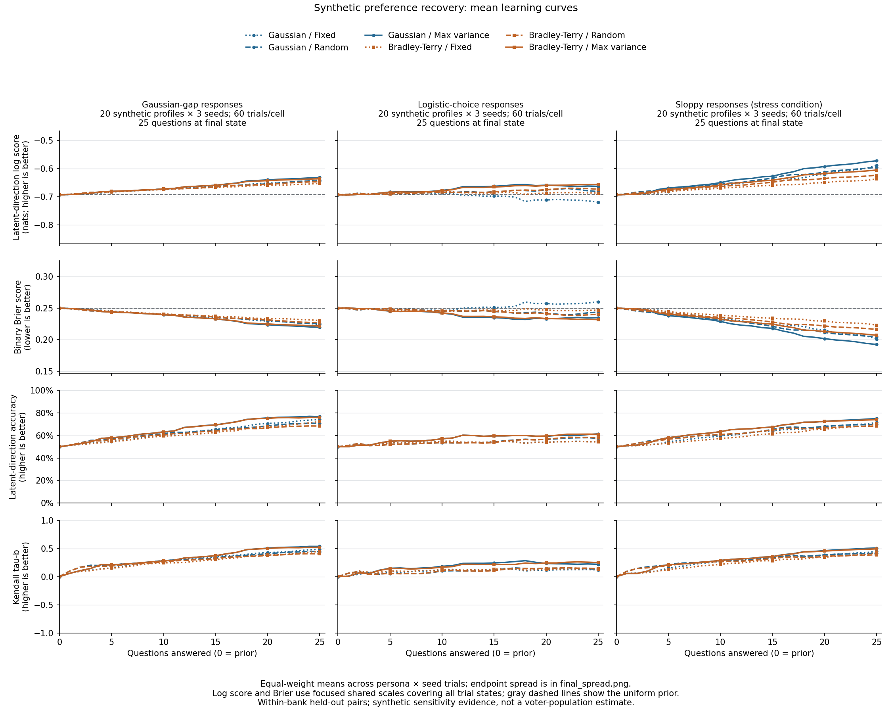
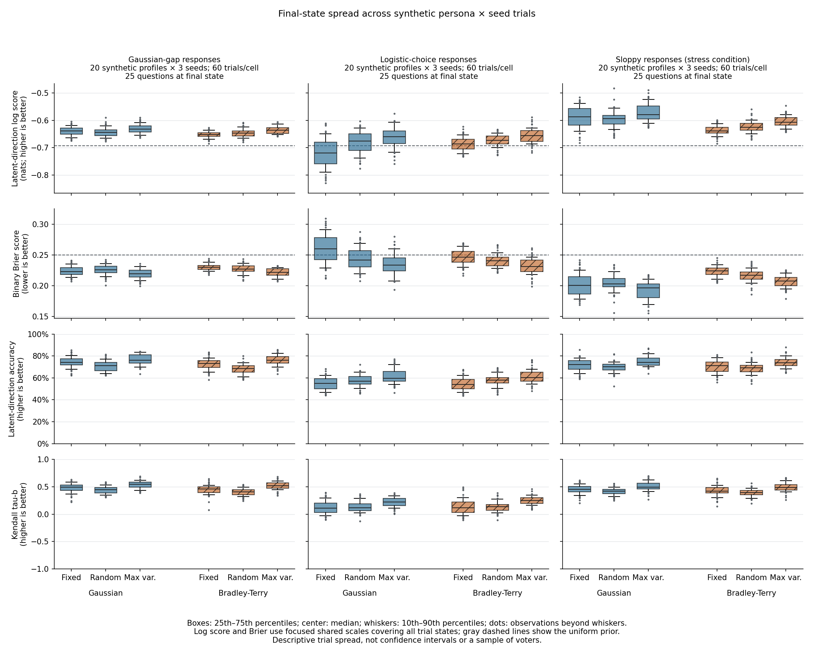
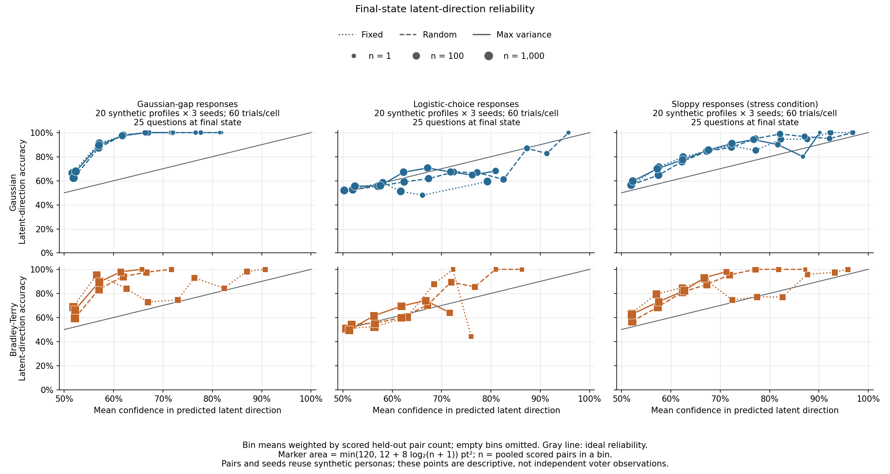

# Synthetic preference recovery benchmark

This benchmark asks how well two existing preference models recover known
latent orderings when question selection and the synthetic response process
change. It measures **withheld-pair interpolation within a fixed 36-item
universe**, not human ballot accuracy, new-topic generalization, or calibration
of the production ballot readout. No LLM, API account, participant record, or
restricted evaluation packet is used.

## Design chosen before this run

The [configuration](config.json) crosses Gaussian and Bradley-Terry models with
fixed-sequence, random, and max-variance acquisition, under Gaussian-gap,
logistic-choice, and sloppy response scenarios. Model parameters remain at
their existing defaults; response parameters are explicit in the configuration.
This is a default-configuration comparison, not a tuned model-family contest.

- 20 generated utility profiles, generator seed `20260916`.
- Trial seeds `42`, `43`, and `44`, reused across comparisons.
- 25 questions per trial; checkpoints include the zero-question prior.
- 20% pair holdout: 126 of 630 unordered pairs; 504 remain eligible for asking.
- 18 cells, 60 trials per cell, 1,080 trials in total.
- No parameter sweep, result-dependent stopping, or selection of a preferred
  scenario after seeing outcomes.

The profiles are Dirichlet mixtures of four existing authored archetypes plus
item-level Gaussian jitter, clipped to [-1, 1]. They are neither sampled voters
nor a representative population. Archetype names are generator provenance,
not model inputs or a claim that political identity explains real people.
The exact generated utilities are retained in `personas.json`.

Across model/policy cells, matching by profile and seed holds the latent
utilities and held-out pair set constant. The paired export uses that blocking
to compare methods on the same cases, separately from the marginal spread
within each cell. Different question paths still attach the same stream's
draws to different item pairs; this is not identical realized answer data.

Within a cell, the existing evaluator also shares each seed's response stream
across profiles. The 60 profile/seed trials are therefore dependent descriptive
replicates, not 60 independent human observations. Pairing is useful for
comparison but does not remove that dependence. No significance tests or
confidence intervals are claimed.

## Reproduce

From the repository root, using Python 3.11 in a virtual environment:

```bash
python -m pip install -r eval/requirements-benchmark.txt
python -m eval.run_synthetic_benchmark --config eval/benchmarks/synthetic_v1/config.json --output-dir .cache/synthetic-v1-reproduction --workers 3
python -m eval.plot_synthetic_benchmark .cache/synthetic-v1-reproduction
```

Use a fresh output directory: the runner refuses to overwrite generated
evidence. `--workers 1` runs the same experiment sequentially. The three
scenarios can execute independently; worker count does not change their seeds.

The published run's `metadata.json` records Python/NumPy/SciPy versions,
resolved model parameters, numerical source and bank hashes, and generated
numerical-artifact hashes. Source hashes normalize CRLF to LF. The local
`.gitattributes` preserves JSON/CSV reference bytes on Windows checkouts.
The plotting command writes a separate `figures.json` with its exact input
hashes, plotting-source hash, environment, and PNG hashes. This checks figure
provenance without changing the numerical run's metadata.
The single-writer plotting command renders all figures in memory and checks
its inputs before replacing published images. It removes the old manifest
before the first image write and publishes the new manifest last. A drawing
failure leaves the old images and manifest untouched; a publication failure
can leave mixed images but no manifest claiming they form a complete set.
Rerun the plotting command to regenerate that set.
Full trials are stored in
deterministic gzip JSON files (timestamp fixed to zero). Same-environment reruns
can be compared byte-for-byte; a different numerical platform can introduce
last-bit differences, and plots also depend on the plotting/font stack.
No timestamps or local paths are embedded in the results.

Verification for this reference package checked all 1,080 trial identities,
28,080 checkpoints, holdout exclusions, denominators, and threshold calculations.
All 18 summary rows, 1,872 curve rows, and 180 reliability rows were independently
recomputed from stored trials. A second full 1,080-trial execution reproduced
all eight original numerical artifacts byte-for-byte after the export changes.
All 6,480 new paired rows were independently checked against their raw endpoints;
all nine current numerical-artifact hashes and 17 source hashes matched. Tiny
benchmark and PNG reruns also matched byte-for-byte. All three full figures
were visually inspected and their input, renderer, and image hashes checked.

Independent review reran the full suite after the publication-failure fix:
all 1,227 repository tests passed. All 40 focused export/plot tests also passed,
including existing-publication failure cases. The three existing deprecation
warnings are unrelated. No web code was changed.

## Reading the metrics

Probability metrics score the sign of the fixed latent utility gap, using the
same evaluation-only posterior direction probability for both models. They do
not score a separately sampled noisy answer. Mean log score is in natural-log
units (higher is better); accuracy is higher-is-better; the one-coordinate
binary Brier score is lower-is-better.

Each trial averages over its scorable holdout pairs, then learning curves and
endpoint summaries weight every trial equally. Latent gaps at or below `1e-9`
are excluded and raw/effective counts are both exported. Probability ties earn
half accuracy credit. Log scores floor probabilities at `1e-9`.

Kendall tau-b compares the posterior-mean ranking against the true ranking over
**all 36 items**, not just held-out pairs. The all-tied prior is assigned zero
rank information. First attainment of tau >= 0.7 is not sustained convergence;
its median is conditional on attainment and must be read with the attainment
count and 25-question limit.

Reliability bins pool final predictions by scored-pair count, unlike the
trial-macro-averaged summary scores. Empty bins are omitted from plots and
exported as blank estimates, not zero accuracy. Bin counts are available in
`reliability.csv`; repeated pairs/profiles are not independent observations.

The fixed baseline asks lexicographically ordered available pairs. At this
budget it concentrates on a small set of anchor items. It is a reproducible
nonadaptive baseline, not an optimized questionnaire. Random selection is an
important additional comparator for max-variance acquisition.

## Files

- `run_config.json`: exact executed settings, separate from the source config.
- `personas.json`: generated latent utilities, names, and generator provenance.
- `gaussian_gap.json.gz`, `logistic_choice.json.gz`, `sloppy.json.gz`: full
  evaluator outputs, including per-trial curves and asked-pair sequences.
- `summary.csv`: all 18 endpoint cells, denominators, and threshold attainment.
- `curves.csv`: every metric/checkpoint mean, SD, and 10th/90th percentiles.
- `reliability.csv`: count-weighted final-state reliability bins.
- `paired_differences.csv`: 6,480 endpoint differences, matched by profile and
  seed. For each scenario, three model contrasts hold policy fixed and six
  policy contrasts hold model fixed; each has 60 blocks and four metrics.
  Every difference is `left_value - right_value`, so a negative Brier difference
  favors the left method. No contrast compares different response scenarios.
- `metadata.json`: execution environment and reproducibility information.
- `learning_curves.png`, `final_spread.png`, `final_reliability.png`: figures
  generated directly from the full trial results.
- `figures.json`: plotting inputs, implementation, environment, and image hashes.

## Results

All 1,080 trials completed the 25-question budget. Every trial has 126 scorable
holdout pairs in this run; no pairs were excluded as latent ties. Each endpoint
cell therefore summarizes 7,560 repeated pair observations across 60 trials,
not 7,560 independent cases. No trial reached tau >= 0.7 by question 25; the
conditional first-attainment medians are consequently blank, not zero.

### Learning curves



Log-score and Brier axes use focused ranges shared across scenarios and across
the learning-curve and endpoint-spread figures. They contain every observed
trial checkpoint plus the prior reference; no observations are clipped. The
reference lines make gains and deterioration from the prior visible.

At the mean endpoint, max-variance acquisition has the highest latent-direction
log score, highest accuracy, lowest Brier score, and highest tau-b within each
model in all three response scenarios. This is a descriptive result for these
profiles, seeds, and default settings, not a significance claim or proof that
adaptive questioning always beats a well-designed questionnaire.

There is no scenario-independent model winner. With max-variance acquisition,
Gaussian has the higher mean log score under Gaussian-gap and sloppy responses;
Bradley-Terry has the higher score under logistic-choice responses. In the last
case Gaussian has slightly higher direction accuracy but worse log and Brier
scores, illustrating why accuracy alone is insufficient.

The full endpoint table preserves every cell in design order. Accuracy is a
percentage; log score uses natural logs. Values are rounded here; exact numbers
are in [summary.csv](summary.csv).

| Response scenario | Model | Questions selected by | Log score ↑ | Accuracy ↑ | Brier ↓ | Tau-b ↑ |
| --- | --- | --- | ---: | ---: | ---: | ---: |
| Gaussian-gap | Gaussian | Fixed | -0.6402 | 74.23% | 0.2239 | 0.4833 |
| Gaussian-gap | Gaussian | Random | -0.6436 | 70.74% | 0.2256 | 0.4431 |
| Gaussian-gap | Gaussian | Max variance | -0.6313 | 76.83% | 0.2194 | 0.5369 |
| Gaussian-gap | Bradley-Terry | Fixed | -0.6523 | 72.41% | 0.2303 | 0.4478 |
| Gaussian-gap | Bradley-Terry | Random | -0.6467 | 68.39% | 0.2271 | 0.4045 |
| Gaussian-gap | Bradley-Terry | Max variance | -0.6358 | 75.95% | 0.2215 | 0.5199 |
| Logistic-choice | Gaussian | Fixed | -0.7191 | 54.55% | 0.2600 | 0.1190 |
| Logistic-choice | Gaussian | Random | -0.6814 | 57.48% | 0.2438 | 0.1314 |
| Logistic-choice | Gaussian | Max variance | -0.6627 | 61.49% | 0.2348 | 0.2193 |
| Logistic-choice | Bradley-Terry | Fixed | -0.6866 | 54.35% | 0.2467 | 0.1335 |
| Logistic-choice | Bradley-Terry | Random | -0.6730 | 57.84% | 0.2403 | 0.1378 |
| Logistic-choice | Bradley-Terry | Max variance | -0.6561 | 61.12% | 0.2318 | 0.2491 |
| Sloppy | Gaussian | Fixed | -0.5883 | 71.52% | 0.2009 | 0.4497 |
| Sloppy | Gaussian | Random | -0.5955 | 69.87% | 0.2043 | 0.4146 |
| Sloppy | Gaussian | Max variance | -0.5722 | 75.00% | 0.1923 | 0.5082 |
| Sloppy | Bradley-Terry | Fixed | -0.6368 | 70.42% | 0.2231 | 0.4254 |
| Sloppy | Bradley-Terry | Random | -0.6233 | 68.51% | 0.2162 | 0.3883 |
| Sloppy | Bradley-Terry | Max variance | -0.6049 | 74.08% | 0.2070 | 0.4928 |

All cells begin at log score -0.6931, accuracy 50%, Brier 0.25, and tau-b 0.
Gaussian with fixed acquisition under logistic-choice responses finishes worse
than that uninformative prior on log and Brier scores, despite accuracy above
50%. That negative result is retained; the response-process assumptions matter.

### Paired method comparisons

The headline model comparison can also be read within the same profile/seed
blocks. Below, both models use max-variance acquisition, and every difference
is **Gaussian minus Bradley-Terry** at question 25. Positive log-score and tau
differences favor Gaussian. The log-score percentiles describe the 60 realized
paired differences, not uncertainty bounds on a population effect.
Under adaptive acquisition, this compares model-plus-questioning trajectories:
different posteriors can choose different questions even under the same policy.
It does not isolate representation alone while holding observed answers fixed.

| Response scenario | Mean log difference | Log p10 | Log p90 | Blocks with higher Gaussian log score | Mean tau-b difference |
| --- | ---: | ---: | ---: | ---: | ---: |
| Gaussian-gap | +0.004484 | -0.006027 | +0.013875 | 45 / 60 | +0.016931 |
| Logistic-choice | -0.006572 | -0.040297 | +0.023172 | 24 / 60 | -0.029776 |
| Sloppy | +0.032685 | +0.009985 | +0.056653 | 58 / 60 | +0.015345 |

The mean ordering changes with the response process, but neither model wins
every block. Overlapping marginal boxes below do not answer this paired
question. All model and policy contrasts, including fixed versus random, are
retained in [the paired export](paired_differences.csv); the table highlights
the same max-variance comparison discussed above rather than selecting a new
favorable contrast.

### Variation across runs



The spread is material, particularly under logistic-choice responses. Boxes
and whiskers describe these realized trials and cannot be interpreted as
confidence intervals on model superiority. The three scenarios are also not
an ordered difficulty ladder: the sloppy generator changes magnitude and
compression as well as adding lapses. Since observation strength affects model
weighting, its better log scores do not mean that careless human answers are
more informative.

### Latent-direction reliability



Reliability varies across scenarios and policies. Many bins under Gaussian-gap
responses lie above the diagonal (conservative probabilities relative to these
latent labels); this is not a calibrated civic-vote claim. High-confidence tails
can have few observations: consult [bin counts](reliability.csv), not the height
of a tail point alone.

## What this supports next

This establishes a reproducible baseline result and a visible active-learning
comparison. It supports carrying both model families and random acquisition
forward as comparators. It does not select an LLM deployment, alter any human-
study gate, validate the authored ballot mapping, or prove that LLM interviewing
helps. The next product milestone remains connecting a real preference posterior
to a public-development ballot and user correction flow.
